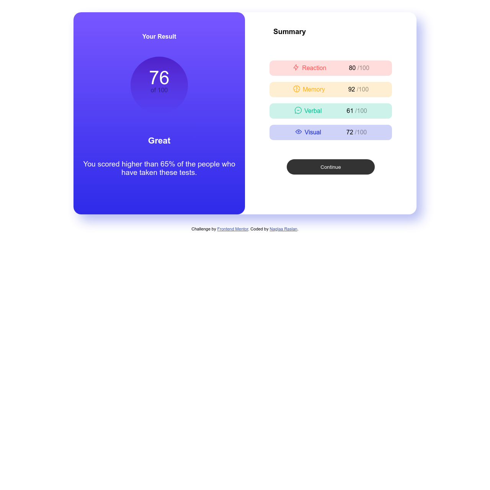

# Frontend Mentor - Results summary component solution

This is a solution to the [Results summary component challenge on Frontend Mentor](https://www.frontendmentor.io/challenges/results-summary-component-CE_K6s0maV). Frontend Mentor challenges help you improve your coding skills by building realistic projects. 

## Table of contents

- [Overview](#overview)
  - [The challenge](#the-challenge)
  - [Screenshot](#screenshot)
  - [Links](#links)
- [My process](#my-process)
  - [Built with](#built-with)
  - [What I learned](#what-i-learned)
- [Author](#author)

**Note: Delete this note and update the table of contents based on what sections you keep.**

## Overview

### The challenge

Users should be able to:

- View the optimal layout for the interface depending on their device's screen size
- See hover and focus states for all interactive elements on the page
- **Bonus**: Use the local JSON data to dynamically populate the content

### Screenshot

- Desktop version: 
- Mobile and Tablet versions: 

### Links

- Solution URL: [Github repo](https://github.com/naglorias/resuls-summary.git)
- Live Site URL: [Live Link](https://naglorias.github.io/resuls-summary/)

## My process

### Built with

- Semantic HTML5 markup
- CSS custom properties
- Flexbox
- CSS Grid
- Simultaneously workflow ( worked on Desktop and mobile in parallel)

**Note: These are just examples. Delete this note and replace the list above with your own choices**

### What I learned
- I learnt how to use css variables;
- I learnt how to change the global css variables values and use them locally;
- I confirmed on understanding flexbox and grid layouts and how to manipulate them in media queries
- I confirmed on understanding how to use media queries and set the right sizing to meet my requirements
- I somehow learnt how to adjust height and width to look well within the whole layout(flexbox  specifically) whether on big screens or small ones

**Note: Delete this note and the content within this section and replace with your own learnings.**

## Author

- Website - [Naglaa Raslan](https://github.com/naglorias)
- Frontend Mentor - [@naglorias](https://www.frontendmentor.io/profile/naglorias)

**Note: Delete this note and add/remove/edit lines above based on what links you'd like to share.**

